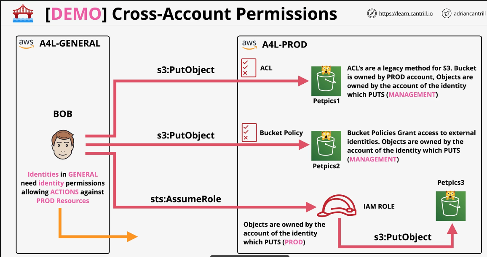

# AWS Cross-Account S3 Permissions Summary

## Overview
This summary describes cross-account permissions for Amazon S3 buckets, focusing on three main methods: ACLs, Bucket Policies, and IAM Roles.

## Account Setup
- **A4L-GENERAL**: Source account containing the user (BOB)
- **A4L-PROD**: Destination account containing S3 buckets

## Methods and Their Characteristics

### 1. ACLs (Access Control Lists)
- Legacy method for S3
- Bucket ownership: PROD account
- Object ownership: Account of the identity performing the PUT operation (MANAGEMENT)
- Use case: `s3:PutObject` from A4L-GENERAL to A4L-PROD

### 2. Bucket Policies
- Grant access to external identities
- Bucket ownership: PROD account
- Object ownership: Account of the identity performing the PUT operation (MANAGEMENT)
- Use case: `s3:PutObject` from A4L-GENERAL to A4L-PROD

### 3. IAM Roles (sts:AssumeRole)
- Allows assuming a role in the destination account
- Bucket ownership: PROD account
- Object ownership: PROD account (the account of the assumed role)
- Use case: `sts:AssumeRole` from A4L-GENERAL to A4L-PROD, then `s3:PutObject` within A4L-PROD

## Important Notes
- Identities in the GENERAL account need specific identity permissions to perform actions against PROD resources.
- The account owning the objects depends on the method used for cross-account access.
- Bucket ownership always remains with the account where the bucket was created (PROD in this case).

## Exam Tip
Pay attention to object ownership differences between these methods, as it's crucial for access control and management in cross-account scenarios.
