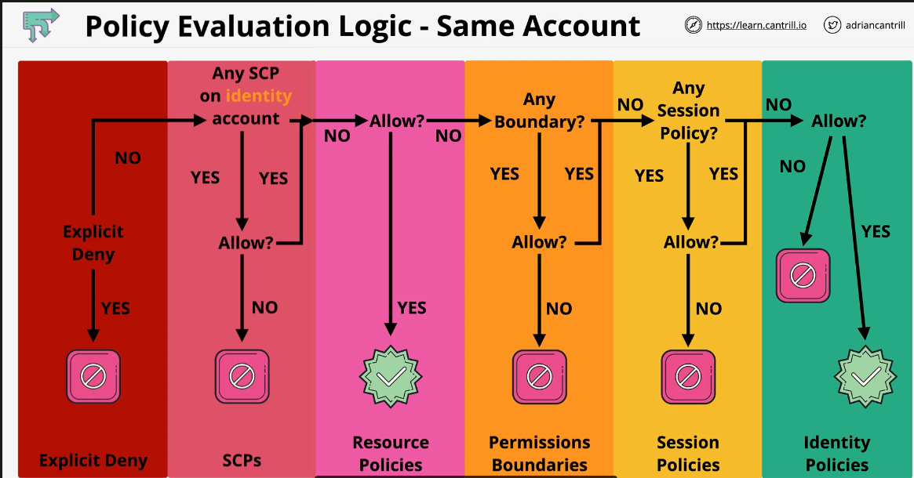

# AWS IAM Policy Evaluation Logic

## Policy Types (in order of evaluation)
1. Organization Service Control Policies (SCPs)
2. Resource Policies
3. IAM Permission Boundaries
4. Session Policies
5. Identity Policies

## Multi-Account vs Single Account Policy Evaluation

### Single Account Policy Evaluation
Policies are evaluated in the following order (from highest to lowest precedence):

1. Explicit Deny
2. SCPs
3. Resource Policies
4. Permission Boundaries
5. Session Policies
6. Identity Policies

AWS first gathers all policies that apply to the access attempt.

### Cross-Account Access Logic
When accessing resources in a different account:

1. The identity from the originating account must allow the action.
2. The resource in the target account must also allow the action.

In other words, both the identity-based policy in the originating account and the resource-based policy in the target account must permit the access.
